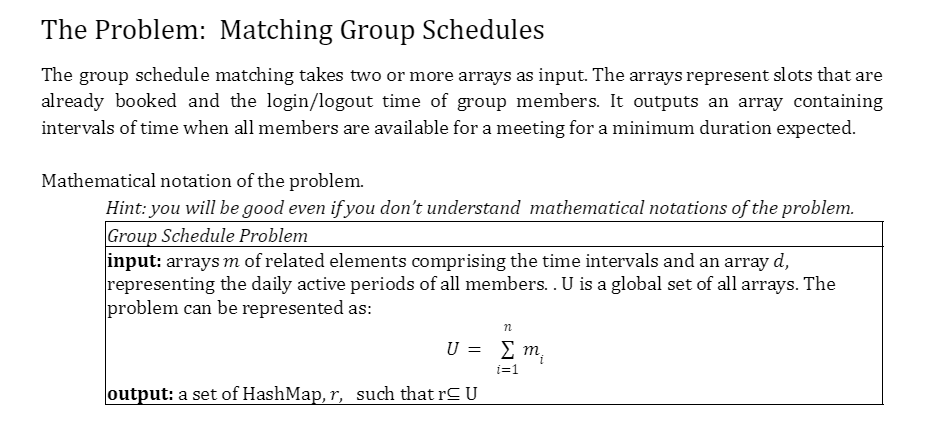

## Team members
- Author: [Sokheng Teang] & [Jacob Armstrong]
- Email: [sokhengteang@csu.fullerton.edu] & [jarmstrong31@csu.fullerton.edu]


## Problem Statement


## Introduction

This project provides an algorithm to find common available time slots for two individuals based on their schedules and the duration required for a meeting. This includes 2 edge cases (examples 3 and 7).

## Setup and Running

### Prerequisites

- Python 3.x

### Instructions

1. Ensure you have Python installed on your machine.
2. Clone or download this repository.
3. Navigate to the directory containing `Project1_starter.py`.
4. Run the Python script using the command:
```bash
python Project1_starter.py
```
 <br/>
 
> Output.txt has been left blank in this repository so you can see it run.